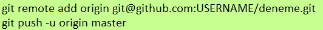
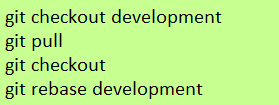

  # An introduction to Git
  Git, a version control system, is a system that keeps track of your changes.
  It helps us to know who made what change and when, and to be able to change it.

   ### **Configure your git environment**
   We need to tell your name and email:

### **Creating a Git repository**
Please create an account on GitLab (http://gitlab.com) and create a public repository called "deneme"

- git clone https://gitlab.com/<gitlab_username>/deneme.git
- cd deneme
- git init  
- git add <path/to/file>
- git commit -m "first commit"

With **git init** command, it creates the GIT directory in your project directory. This directory contains data such as your project's repo address, project flow, information.

 **"Git add ."** command indexes all files in the current directory.

 if you want to delete a file you can use **"git -rm"** command.

    git commit
  
   A commit message should
succinctly describe what you’re committing in the first line.

### **Modifying files**

It gives information about the current status of the project files. Shows files whose status has changed.

Having just committed ypur changes , you should receive the message;

    On branch master
    nothing to commit, working directory clean

The touch command is used to set the date and time on a file to the current date.

  

   If the file doesn’t exist, it creates it, so we are just using this to create an empty file.
   End your output from git status;

    On branch master
    Untracked files:
    (use "git add <file>..." to include in what will be committed)
    test.txt

We can list what commits;

### **Synchronizing your local Git repository with GitHub**

After your commit changes, you need to do is git push your changes onto GitHub.  
You can find your test.txt file on your page.

**"git status"** gives information about the current status of the project files. Shows files whose status has changed.

### **Branching**

Creating a branch gives the user access to different versions of the project they are working on. When the user wants to add something new to his project, the change may affect the project negatively. In such cases, we can use branch to avoid breaking our project.

We create a new branch using;

You can confirm
which branch you are currently using:

If we wish to return to the ‘master’ branch we can do so with:

### **Differences Between Branches**
We can use git diff to look at differences between branches or commits:

 
 
 This will show us the differences between the current (‘branch_name’) branch and the ‘master’ branch.

 ### **Merging branches**
 

 **"git rebase"** command is also an alternative to the merge command used to integrate two branches.

 

  ### **Git Conflig**
  You want to merge changes from your-branch into the master for others to see them, but someone else did conflicting changes to the master  in the meantime.

  When you run **"git status"** , git will tell you that there are unintegrated files in your branch.
  
 ( https://www2.stat.duke.edu/courses/Fall19/sta199.001/slides/lab-slides/03-lab-slides.html#6)

 After deciding on the content of the file, we can run commit command

    git commit

How to undo a merge in Git?

How do I continue rebase after conflicts?

